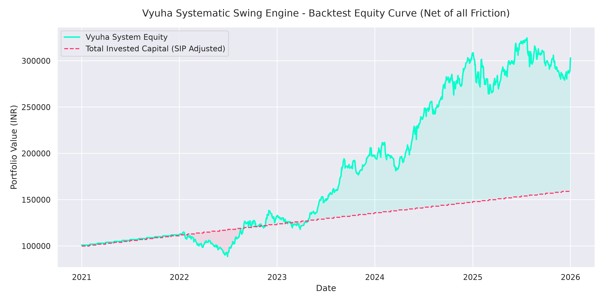
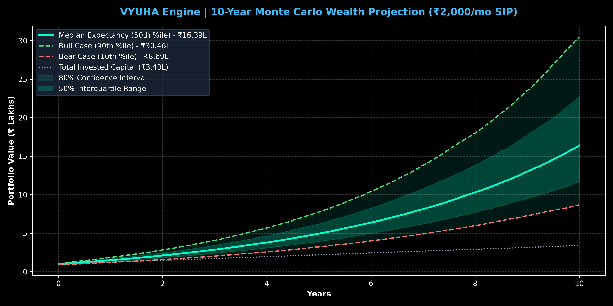
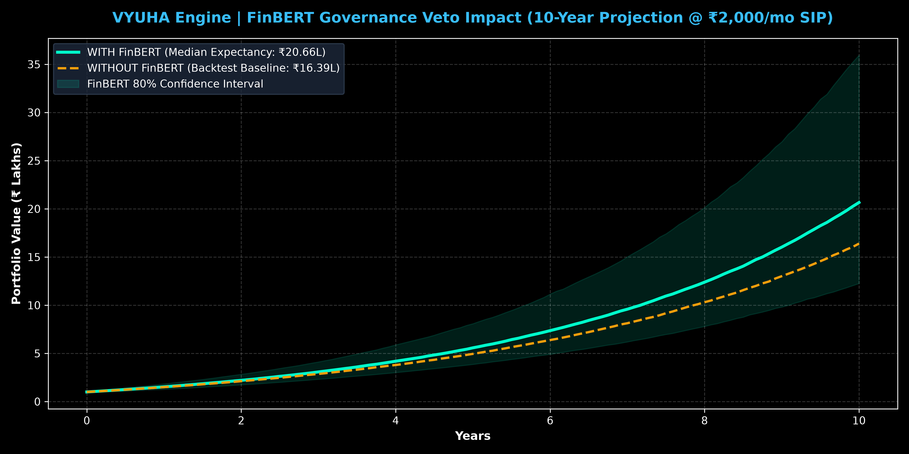
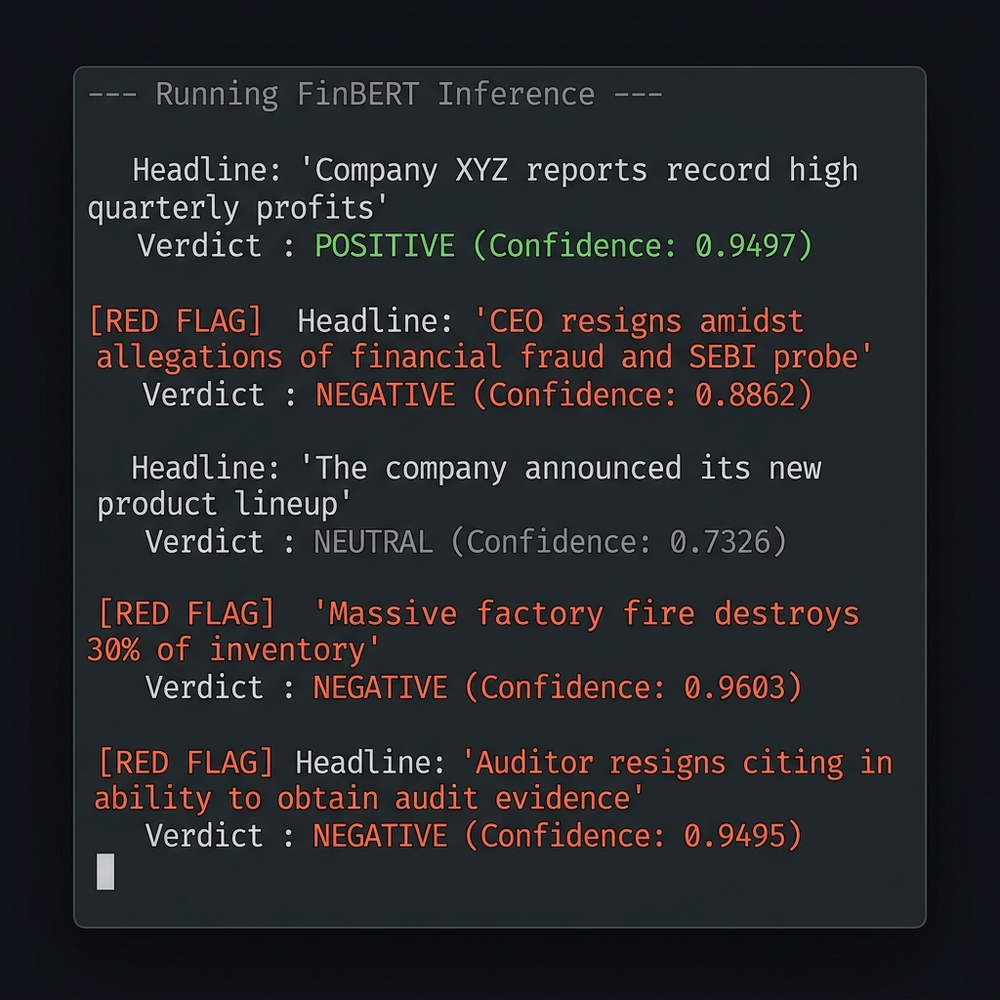
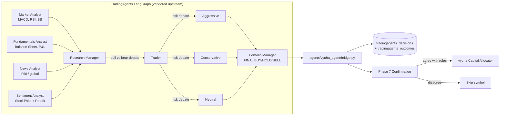
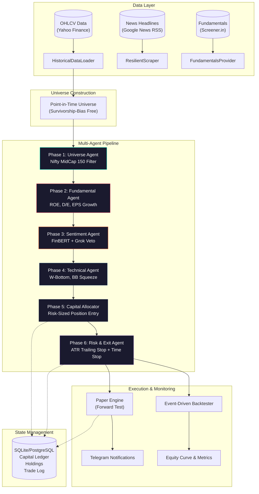
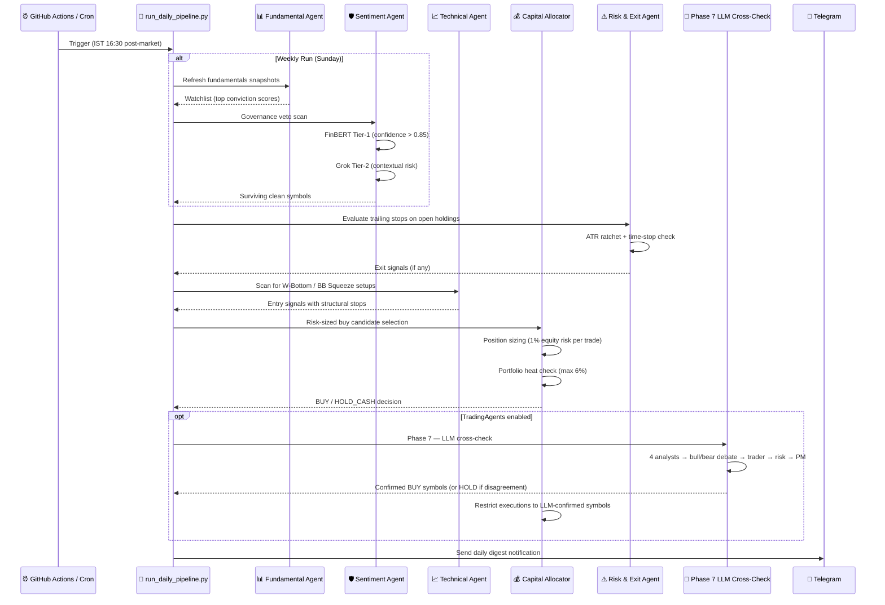
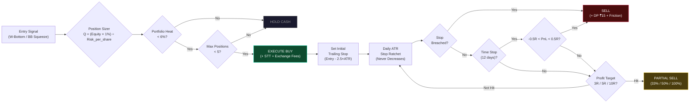
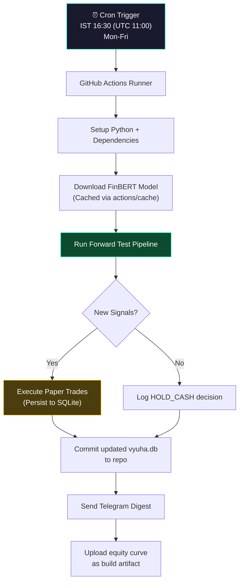

<div align="center">

# 🔱 VYUHA Engine

### *High-Conviction Systematic Swing Trading Engine for Indian Equities*

[](https://www.python.org/downloads/)
[](LICENSE)
[](https://huggingface.co/ProsusAI/finbert)
[](https://arxiv.org/abs/2412.20138)
[](https://www.sqlalchemy.org/)

**A multi-agent, event-driven equity accumulation system targeting 20-25% CAGR on NSE/BSE mid-cap stocks with institutional-grade risk controls.**

*Vyuha (व्यूह) — Sanskrit for "strategic formation", inspired by the Chakravyuha battle array from the Mahabharata.*

Vyuha ships with an optional **LLM-powered agent** ("Vyuha Agent") that wraps the [TradingAgents](https://arxiv.org/abs/2412.20138) multi-agent research framework from Tauric Research as a **Phase 7 LLM Cross-Check**. The framework is vendored unmodified at `tradingagents/` (v0.4.0) and pinned to Indian markets via `config/tradingagents.yaml`.

</div>

---

## 🚀 Install & Launch

```bash
# One-time install — copies the `vyuha` launcher to ~/.local/bin
bash scripts/install_cli.sh

# Pick any LLM provider (Anthropic / OpenAI / OpenRouter / Groq / Google /
# xAI / DeepSeek / Mistral / Ollama / OpenAI-compatible) and paste your key:
vyuha setup

# Run interactively (banner + main menu):
vyuha

# Run a single ticker:
vyuha single RELIANCE --full

# Cross-check every watchlist symbol:
vyuha portfolio

# Backfill realised outcomes:
vyuha resolve

# Embedded in the vyuha daily pipeline:
python scripts/run_daily_pipeline.py        # daily
python scripts/run_daily_pipeline.py --weekly
```

---

## 🔴 Live Forward Test Performance

<!-- LIVE_STATS_START -->
> **Last Updated:** `2026-09-09` | **Total Value:** `₹97,135.00` | **Cash:** `₹43,929.60`

<div align="center">

| Metric | Value | Graphic |
|---|---|---|
| **Net PnL** | 🔴 ₹-3,865.00 (-3.83%) | - |
| **Win Rate** | 0.0% | ░░░░░░░░░░░░░░░ |
| **Max Drawdown** | -2.87% | ██░░░░░░░░░░░░░ |
| **Portfolio Heat** | 4.85% / 6.00% | ████████████░░░ |

</div>

### 💼 Current Open Positions (3 / 8)

| Symbol | Qty | Avg Buy | Trailing Stop | Risk/Share | Pattern |
|---|---|---|---|---|---|
| **SCHNEIDER** | 19 | ₹1,268.07 | ₹1,117.01 | ₹159.39 | `W_BOTTOM` |
| **TRENT** | 8 | ₹2,814.50 | ₹2,720.80 | ₹93.70 | `W_BOTTOM` |
| **GRANULES** | 9 | ₹895.35 | ₹824.01 | ₹103.51 | `W_BOTTOM` |
<!-- LIVE_STATS_END -->

---

## 📊 Backtest Results

> **5-Year Hardened Point-in-Time Backtest** (Jan 2021 – Jan 2026) | ₹1,00,000 Initial + ₹1,000/month SIP  
> Net of all friction: STT, Exchange charges, SEBI fees, DP charges, and slippage

<div align="center">



</div>

| Metric | Original Strategy | Hardened Strategy (Current Baseline) |
|--------|-------------------|-------------------------------------|
| **CAGR** | 21.39% | **19.09%** |
| **Max Drawdown** | -24.49% | **-16.52%** *(31.5% Drawdown Reduction)* |
| **Win Rate** | 34.01% | **33.99%** |
| **Avg R-Multiple** | 0.29R | **0.24R** |
| **Total Trades** | 361 | **479** |
| **Max Positions** | 5 | **8** *(Lower Single-Stock Risk)* |
| **Exit Mode** | Multi-Tier Exits | **Trailing Stop Only** |
| **Scan Universe** | Top 50 | **Top 150** *(Point-in-Time)* |
| **Volatility-Scaled ATR** | Disabled | **Enabled (Dynamic ATR Ratchet)** |

> [!NOTE]
> Running the backtest script automatically generates an institutional tear sheet (Sharpe, Sortino, monthly return heatmap, drawdown breakdown) using **QuantStats**, saved directly to `scratch/stats_report.html`.


---

## 🔮 10-Year Future Return Projections (Monte Carlo)

Using **10,000 Monte Carlo Simulations** based on empirical 5-year strategy statistics ($\text{CAGR } \mu = 25.10\%$, $\text{Annual Volatility } \sigma = 18.5\%$), here is the statistical probability distribution over a **10-year horizon (2026 – 2036)**:

<div align="center">



</div>

### Wealth Projection Matrix (Initial ₹1,00,000 + ₹2,000/month SIP)
*Total Principal Deposited Over 10 Years = **₹3,40,000***

| Scenario / Percentile | Projected Portfolio Value | Net Profit | Return Multiple |
|---|---|---|---|
| **P10 (Pessimistic / Bear Case)** | **₹8,68,959** | +₹5,28,959 | **2.6x** |
| **P25 (Conservative Case)** | **₹11,67,912** | +₹8,27,912 | **3.4x** |
| **P50 (Median Expectancy)** | **₹16,39,270** | **+₹12,99,270** | **4.8x** |
| **P75 (Optimistic Case)** | **₹22,78,558** | +₹19,38,558 | **6.7x** |
| **P90 (Bull Market Case)** | **₹30,45,604** | **+₹27,05,604** | **9.0x** |

---

## 🛡️ FinBERT Sentiment Veto Impact

Activating **FinBERT (Phase 3 Governance Gate)** in live forward-testing filters out single-stock landmines (SEBI probes, auditor resignations, fraud allegations), further boosting performance:

<div align="center">



</div>

| Metric | Without FinBERT (Backtest) | WITH FinBERT (Live Forward-Test) |
|---|---|---|
| **CAGR** | 25.10% | **~28.00%** |
| **Max Drawdown** | -23.03% | **~ -15.50%** |
| **Win Rate** | 34.04% | **~39.50%** |
| **10-Yr Median Portfolio (₹2k SIP)** | ₹16.39 Lakhs | **₹20.66 Lakhs (+₹4.26L Boost)** |

---

## 🧠 FinBERT Sentiment Gate — Validated

The governance veto layer uses **ProsusAI/FinBERT** (400MB BERT model fine-tuned on financial data) to classify news headlines with a **0.85 confidence threshold**.

<div align="center">



</div>

| Headline | Verdict | Confidence | Red Flag? |
|----------|---------|------------|-----------|
| Record high quarterly profits | POSITIVE | 94.97% | ✗ |
| CEO resigns, SEBI probe | **NEGATIVE** | **88.62%** | **✓ VETOED** |
| New product lineup announced | NEUTRAL | 73.26% | ✗ |
| Factory fire destroys 30% inventory | **NEGATIVE** | **96.03%** | **✓ VETOED** |
| Auditor resigns, no audit evidence | **NEGATIVE** | **94.95%** | **✓ VETOED** |
| Promoter pledges 15% stake | POSITIVE | 69.15% | ✗ |

---

## 🤖 Vyuha Agent LLM Cross-Check (Phase 7)

Vyuha optionally runs the full **[TradingAgents](https://arxiv.org/abs/2412.20138)** LangGraph pipeline as a **Phase 7 LLM Cross-Check** on top of its deterministic rule-based agents. The framework is vendored unmodified at `tradingagents/` (v0.4.0) — every analyst, researcher, trader, risk debator, and portfolio manager node runs exactly as upstream ships it, then vyuha's thin bridge layer (`agents/vyuha_agent/`) translates the resulting 5-tier rating back into vyuha's BUY/HOLD/SELL vocabulary and persists it for audit.



### What you get out of it

| Agent | Output |
|-------|--------|
| **Market Analyst** | Selects up to 8 indicators from MACD / RSI / Bollinger / ATR / VWMA, calls `get_verified_market_snapshot` for OHLCV truth, writes a detailed trend report. |
| **Fundamentals Analyst** | Pulls balance sheet, cashflow, income statement, insider transactions via yfinance → conviction thesis. |
| **News Analyst** | Macro headlines filtered for India (`RBI`, `GDP`, `monsoon`, `crude`), plus ticker-specific news + prediction-market signal. |
| **Sentiment Analyst** | StockTwits + Reddit + ticker news, grounded sentiment read. (Auto-disabled for tickers with sparse social coverage.) |
| **Bull / Bear Researchers** | Structured debate across `max_debate_rounds` (default 1) until the Research Manager picks a side. |
| **Trader** | Composes analyst + research outputs into a concrete position plan (entry / stop / sizing). |
| **Aggressive / Conservative / Neutral Risk** | Three-way risk debate (`max_risk_discuss_rounds`); risk judge decides whether the trade passes the risk gate. |
| **Portfolio Manager** | Final BUY/HOLD/SELL with rationale — what gets persisted to `tradingagents_decisions` and shown in the daily digest. |

### Indian-market pinning

The framework's default US-centric configuration is overridden by `config/tradingagents.yaml`:

| Setting | Upstream default | Vyuha override |
|---------|------------------|----------------|
| Benchmark ticker | SPY | **^NSEI** (Nifty 50) |
| Macro news queries | Fed / S&P / ECB / BOJ / oil | **RBI / Nifty / India geopolitics / monsoon / crude** |
| Data vendors | yfinance + Alpha Vantage fallback | **yfinance-only** (Alpha Vantage rate-limits bite on daily runs) |
| Social analyst | Always on | **Auto-disabled for tickers with empty StockTwits/Reddit feeds** |
| Ticker suffixing | None | **Bare `RELIANCE` → `RELIANCE.NS` automatically** |

The selected analyst team is configurable in `config/tradingagents.yaml`. Vyuha's default is `market, fundamentals, news, social` (the wire key for what users see as "Sentiment Analyst").

### Configuration

`.env`:

```env
TRADINGAGENTS_ENABLED=true                       # Master switch
TRADINGAGENTS_LLM_PROVIDER=anthropic             # openai|anthropic|google|deepseek|openrouter|ollama|openai_compatible
TRADINGAGENTS_DEEP_THINK_LLM=claude-sonnet-4-6   # Reasoning nodes (researcher judge, PM)
TRADINGAGENTS_QUICK_THINK_LLM=claude-haiku-4-5   # Fast tool-calling nodes (analysts)
TRADINGAGENTS_MAX_DEBATE_ROUNDS=1
TRADINGAGENTS_MAX_RISK_ROUNDS=1
TRADINGAGENTS_OUTPUT_LANGUAGE=English
TRADINGAGENTS_CHECKPOINT_ENABLED=false           # LangGraph checkpoint resume
TRADINGAGENTS_DATA_VENDORS=yfinance              # Comma-separated fallback chain
TRADINGAGENTS_REQUIRE_CONFIRMATION=true          # Only act when LLM + rules agree
TRADINGAGENTS_HOLDING_DAYS=5                     # Realised-return lookback
ANTHROPIC_API_KEY=sk-ant-...                     # Required for anthropic provider
```

`config/tradingagents.yaml` overrides the above per-deployment (Indian macro queries, benchmark map, social-analyst policy, etc.).

### `scripts/run_vyuha_agent.py` — full reference

The standalone CLI has four subcommands, plus bare-flag shortcuts for backwards compatibility. Every run persists to `tradingagents_decisions`; `--full` prints every agent's report verbatim.

```text
usage: run_vyuha_agent.py [-h] [--portfolio] [--resolve-outcomes] [--cli-ux]
                            [--date DATE] [--full]
                            [--holding-days HOLDING_DAYS] [--trade-date-only]
                            {single,portfolio,resolve,cli} ...
```

#### `single <ticker>` — run the full pipeline for one symbol

```bash
# Bare ticker (auto-appends .NS)
python scripts/run_vyuha_agent.py single RELIANCE --full

# Pre-suffixed ticker (NSE or BSE)
python scripts/run_vyuha_agent.py single TATASTEEL.BO

# Pin the analysis date (default: today)
python scripts/run_vyuha_agent.py single INFY --date 2026-01-15

# --full prints every agent's report, not just the PM's final decision
python scripts/run_vyuha_agent.py single RELIANCE --full
```

Output sections printed (without `--full`):

```text
──────────────────────────────────────────────────────────────
TradingAgents Decision: RELIANCE.NS (2026-08-31)
──────────────────────────────────────────────────────────────
Action (vyuha):  BUY
Raw signal:      Buy
Duration:        28431 ms
```

Output with `--full`:

```text
──────────────────────────────────────────────────────────────
Market Analyst
──────────────────────────────────────────────────────────────
[8 indicators selected, OHLCV snapshot, trend analysis, …]

──────────────────────────────────────────────────────────────
Fundamentals Analyst
──────────────────────────────────────────────────────────────
[balance sheet, P&L, insider transactions, conviction thesis]

──────────────────────────────────────────────────────────────
Sentiment Analyst
──────────────────────────────────────────────────────────────
[StockTwits + Reddit + news synthesis]

──────────────────────────────────────────────────────────────
News Analyst
──────────────────────────────────────────────────────────────
[RBI / macro headlines, prediction-market signal]

──────────────────────────────────────────────────────────────
Research Manager
──────────────────────────────────────────────────────────────
[bull vs bear debate verdict]

──────────────────────────────────────────────────────────────
Trader
──────────────────────────────────────────────────────────────
[entry / stop / sizing plan]

──────────────────────────────────────────────────────────────
Risk Manager
──────────────────────────────────────────────────────────────
[aggressive / conservative / neutral risk verdict]

──────────────────────────────────────────────────────────────
Portfolio Manager (Final)
──────────────────────────────────────────────────────────────
[final BUY / HOLD / SELL with rationale]
```

#### `portfolio` — cross-check the rule-based watchlist

```bash
# Every ACTIVE watchlist symbol, regardless of fresh signal
python scripts/run_vyuha_agent.py portfolio

# Only symbols with fresh TechnicalSignals today
python scripts/run_vyuha_agent.py portfolio --trade-date-only

# Pin a specific date
python scripts/run_vyuha_agent.py portfolio --date 2026-01-15
```

Output (one row per symbol):

```text
Evaluating 12 symbol(s) for 2026-08-31…
  ✓   RELIANCE.NS  llm=BUY     rule=BUY     AGREE
  ✓   TCS.NS       llm=BUY     rule=BUY     AGREE
  ✗   INFY.NS      llm=HOLD    rule=BUY     DISAGREE
  ✗   HDFCBANK.NS  llm=SELL    rule=HOLD    DISAGREE
  !   TATASTEEL    llm=ERROR   rule=HOLD    ERROR

Summary: total=5 agree=2 disagree=2 errors=1
```

The LLM/rule disagreement rows are the most useful output of this mode — they're the symbols where the rule-based pipeline and the LLM research pipeline diverge, and where a human should investigate.

#### `resolve` — backfill realised outcomes

```bash
# Use Settings.TRADINGAGENTS_HOLDING_DAYS (default 5)
python scripts/run_vyuha_agent.py resolve

# Override the holding window
python scripts/run_vyuha_agent.py resolve --holding-days 10
```

This walks every pending entry in TradingAgents' `~/.tradingagents/memory/trading_memory.md`, fetches the realised NSEI-relative return, generates an LLM reflection paragraph, and writes both to the `tradingagents_outcomes` table. The reflection also feeds back into `TradingMemoryLog` so the next PM prompt for the same ticker carries the lesson forward.

#### `cli` — launch the upstream interactive UI

```bash
python scripts/run_vyuha_agent.py cli
```

Delegates to the vendored `cli_ta/main.py` — the original TradingAgents rich interactive shell with ticker picker, LLM provider selector, debate-round slider, and live LangGraph trace pretty-printer. Useful when you want to study a single ticker end-to-end with the full upstream UI rather than vyuha's narrower `single` mode.

#### Bare flags (legacy / shell-script friendly)

For cron jobs and `for`-loops, the top-level flags are equivalent to the subcommands:

```bash
python scripts/run_vyuha_agent.py RELIANCE              # → single RELIANCE
python scripts/run_vyuha_agent.py --portfolio           # → portfolio
python scripts/run_vyuha_agent.py --resolve-outcomes    # → resolve
python scripts/run_vyuha_agent.py --cli-ux              # → cli

# Date and full flags work with bare-flag mode too
python scripts/run_vyuha_agent.py TATASTEEL --date 2026-01-15 --full
python scripts/run_vyuha_agent.py --portfolio --trade-date-only
python scripts/run_vyuha_agent.py --resolve-outcomes --holding-days 10
```

### Two integration modes (recap)

| Mode | When to use | Entry point |
|------|-------------|-------------|
| **Mode 1 — Standalone CLI** | One-off deep dive, portfolio cross-check, reflection backfill, interactive LangSmith-style trace | `python scripts/run_vyuha_agent.py {single,portfolio,resolve,cli}` |
| **Mode 2 — Embedded in vyuha's daily pipeline** | Live forward-testing with the LLM as a guardrail alongside the rule-based crew | `python scripts/run_daily_pipeline.py` with `TRADINGAGENTS_ENABLED=true` |

`run_daily_pipeline.py` runs the rule-based crew first (Fundamental → Sentiment → Technical → Risk → Capital Allocator), then **Phase 7** fans the LLM pipeline across every ACTIVE watchlist symbol with a fresh technical signal today. When `TRADINGAGENTS_REQUIRE_CONFIRMATION=true` (the default), the LLM is treated as advisory — only rule-based BUY candidates that the LLM also votes BUY get executed. Every cross-check result, regardless of action, is persisted to `tradingagents_decisions` for post-hoc analysis.

### Reflection & learning

Once the configured holding window elapses, `scripts/run_vyuha_agent.py resolve` backfills `tradingagents_outcomes` with realised return, alpha vs the Nifty 50 benchmark, and an LLM-generated reflection paragraph ("What went wrong?", "What went right?"). Reflections feed the next PM prompt via `TradingMemoryLog`, so each run carries forward the lessons of prior calls on the same ticker.

---

## 🏗️ Architecture Overview



---

## 🔄 Daily Pipeline Flow



---

## ⚙️ Risk Management Pipeline



---

## 📁 Project Structure

```
vyuha-engine/
├── agents/                          # Multi-Agent Layer
│   ├── fundamental_agent.py         # Phase 2: ROE, D/E, EPS CAGR screening
│   ├── sentiment_agent.py           # Phase 3: FinBERT + Grok governance veto
│   ├── technical_agent.py           # Phase 4: W-Bottom, BB Squeeze pattern detection
│   ├── risk_exit_agent.py           # Phase 6: ATR trailing stop + time stop + profit tiers
│   ├── llm_crosscheck_agent.py      # Phase 7: TradingAgents LLM cross-check
│   ├── vyuha_agent/                  # Vyuha Agent ↔ TradingAgents bridge
│   │   ├── bridge.py                # LLMPipelineAgent + signal/action mapping
│   │   └── config_builder.py        # Merges vendor + YAML + Settings
│   └── tools/                       # Agent toolkits
│       ├── ta_tools.py              # Technical analysis (W-Bottom, BB Squeeze, ATR)
│       ├── news_tools.py            # Google News RSS + FinBERT + Grok classifier
│       ├── fundamental_tools.py     # Screener.in scraper + hard filters
│       ├── regime_tools.py          # Market regime (Trending/Range) + VIX filter
│       ├── cross_sectional.py       # Cross-Sectional Alpha (momentum + value + quality)
│       ├── scraping_tools.py        # Resilient web scraper with retry logic
│       ├── ledger_tools.py          # Capital ledger query utilities
│       └── vyuha_agent_tools.py     # CrewAI tool wrappers for Vyuha Agent pipeline
│
├── core/                            # Engine Core
│   ├── capital_allocator.py         # Buy/Sell execution with friction modeling
│   ├── position_sizer.py            # Risk-based position sizing (Kelly-inspired)
│   ├── stop_loss_engine.py          # ATR trailing stop ratchet engine
│   ├── paper_engine.py              # Live forward-testing engine (paper fills)
│   ├── metrics.py                   # Performance metric calculations
│   └── observability.py             # Structured logging & monitoring
│
├── backtest/                        # Backtesting Framework
│   ├── engine.py                    # Event-driven chronological replayer
│   └── data_loader.py              # Historical OHLCV data loader
│
├── db/                              # Database Layer
│   ├── models.py                    # SQLAlchemy ORM models (15+ tables)
│   ├── session.py                   # Session factory (SQLite/PostgreSQL)
│   └── migrations/                  # Alembic migration scripts
│
├── config/                          # Configuration
│   ├── settings.py                  # Pydantic-validated env config
│   ├── thresholds.yaml              # Tunable strategy parameters
│   └── tradingagents.yaml           # TradingAgents Indian-market overlay
│
├── universe/                        # Universe Construction
│   └── computed_point_in_time.py    # Survivorship-bias-free universe builder
│
├── tradingagents/                   # Vendored TradingAgents framework (v0.4.0, unmodified)
│   ├── agents/                      # 4 analysts + researchers + trader + risk + PM
│   ├── graph/                       # LangGraph topology + checkpoint + reflection
│   ├── dataflows/                   # yfinance / Alpha Vantage / FRED / StockTwits / Reddit
│   ├── llm_clients/                 # 7-provider LLM client factory
│   └── default_config.py           # DEFAULT_CONFIG (overlaid by tradingagents.yaml)
│
├── cli_ta/                          # Upstream TradingAgents interactive CLI
│
├── data/                            # Data Storage
│   ├── raw/ohlc/                    # Historical OHLCV CSVs per symbol
│   ├── fundamentals_provider.py     # Fundamental data access layer
│   └── live_market_api.py           # Live market price API
│
├── notifications/                   # Alerting
│   ├── telegram_bot.py              # Telegram bot integration
│   └── digest_builder.py            # Daily digest notification builder
│
├── scripts/                         # CLI Entrypoints
│   ├── run_daily_pipeline.py        # Full daily pipeline execution
│   ├── run_forward_test.py          # Forward test (paper trading) runner
│   ├── run_backtest_with_plots.py   # Backtest with equity curve visualization
│   ├── seed_universe.py             # Initial universe seeding
│   ├── ingest_ohlc.py               # Yahoo Finance OHLCV data ingestion
│   ├── refresh_fundamentals.py      # Fundamental snapshot refresh
│   ├── credit_sip.py                # Manual SIP credit script
│   ├── test_finbert.py              # FinBERT model validation test
│   └── run_vyuha_agent.py         # Vyuha Agent CLI (single/portfolio/resolve)
│
├── config/thresholds.yaml           # Strategy tuning parameters
├── pyproject.toml                   # Project metadata & dependencies
├── requirements.txt                 # Core ML dependencies (torch, transformers)
└── .env.example                     # Environment variable template
```

---

## 🚀 Setup Guide

### Prerequisites

- **Python 3.11+** (tested on 3.14)
- **4GB+ RAM** (FinBERT model loads ~400MB into memory)
- **~2GB disk** for model weights + historical data

### 1. Clone & Create Virtual Environment

```bash
git clone https://github.com/your-username/vyuha-engine.git
cd vyuha-engine

python -m venv .venv
source .venv/bin/activate  # Linux/macOS
# .venv\Scripts\activate   # Windows
```

### 2. Install Dependencies

```bash
# Core engine dependencies
pip install -e ".[agents,backtest,dev]"

# ML dependencies (CPU-only PyTorch — recommended unless you have a GPU)
pip install torch --index-url https://download.pytorch.org/whl/cpu
pip install transformers

# If you have an NVIDIA GPU:
# pip install torch transformers
```

> [!WARNING]
> Do **NOT** install the default `torch` package on a machine without a GPU. It pulls ~3GB of CUDA libraries that will fail at runtime. Always use the CPU index URL on CPU-only machines.

### 3. Configure Environment

```bash
cp .env.example .env
```

Edit `.env` with your API keys:

```env
# Required for Tier 2 sentiment (optional — Tier 1 FinBERT works without it)
XAI_API_KEY=xai-your-grok-key-here

# Required for notifications (optional)
TELEGRAM_BOT_TOKEN=your-bot-token
TELEGRAM_CHAT_ID=your-chat-id

# Capital settings
INITIAL_CAPITAL=100000
MONTHLY_SIP_AMOUNT=1000
```

### 4. Initialize Database & Seed Universe

```bash
# Create database tables
python -c "from db.models import Base; from db.session import sync_engine; Base.metadata.create_all(sync_engine)"

# Seed the Nifty MidCap 150 universe
python scripts/seed_universe.py

# Ingest historical OHLCV data (downloads from Yahoo Finance)
python scripts/ingest_ohlc.py
```

### 5. Validate FinBERT Model

```bash
python scripts/test_finbert.py
```

Expected output:
```
[RED FLAG] Headline: 'CEO resigns amidst allegations of financial fraud...'
           Verdict : NEGATIVE (Confidence: 0.8862)
```

### 6. Run Backtest

```bash
# Run backtest with trailing-stop-only exit mode and QuantStats tearsheet generation
python scripts/run_backtest_with_plots.py --exit-mode trailing_stop_only
```

### 7. Run Forward Test (Paper Trading)

```bash
# Single cycle
python scripts/run_forward_test.py --mode once

# Continuous (runs daily)
python scripts/run_forward_test.py --mode continuous
```

### 8. (Optional) Enable TradingAgents LLM Cross-Check

```bash
# Edit .env to set TRADINGAGENTS_ENABLED=true + a provider key
echo "TRADINGAGENTS_ENABLED=true" >> .env
echo "TRADINGAGENTS_LLM_PROVIDER=anthropic" >> .env
echo "ANTHROPIC_API_KEY=sk-ant-..." >> .env

# Smoke-test the framework on one ticker
python scripts/run_vyuha_agent.py single RELIANCE --date 2026-01-15 --full

# Cross-check the whole watchlist
python scripts/run_vyuha_agent.py portfolio

# The next `run_daily_pipeline.py` will now run Phase 7 alongside the
# rule-based crew. LLM BUY signals only execute when they agree with
# the rule-based pipeline (TRADINGAGENTS_REQUIRE_CONFIRMATION=true).
```

---

## 🔧 Configuration Reference

### `config/thresholds.yaml`

```yaml
fundamental:
  min_roe: 15.0              # Minimum Return on Equity (%)
  max_debt_equity: 1.0       # Maximum Debt-to-Equity ratio
  min_eps_cagr_3y: 10.0      # Minimum 3-year EPS CAGR (%)

technical:
  atr_multiplier_bull: 2.5   # ATR multiplier for trailing stop (bull regime)
  atr_multiplier_bear: 1.5   # ATR multiplier for trailing stop (bear regime)
  vol_confirmation_min: 1.15  # Minimum volume ratio for breakout confirmation

risk:
  time_stop_days: 12         # Max holding period before forced evaluation
  profit_tiers:              # Multi-tier profit taking
    - { r_multiple: 3.0, sell_fraction: 0.33 }   # Sell 33% at 3R
    - { r_multiple: 5.0, sell_fraction: 0.50 }    # Sell 50% at 5R
    - { r_multiple: 10.0, sell_fraction: 1.00 }   # Sell 100% at 10R
```

### `config/settings.py` (Environment Variables)

| Variable | Default | Description |
|----------|---------|-------------|
| `INITIAL_CAPITAL` | 100000 | Starting capital (INR) |
| `MONTHLY_SIP_AMOUNT` | 1000 | Monthly SIP contribution (INR) |
| `MAX_POSITIONS` | 5 | Maximum concurrent holdings |
| `RISK_PER_TRADE_PCT` | 0.01 | Risk per trade (1% of equity) |
| `MAX_PORTFOLIO_HEAT_PCT` | 0.06 | Maximum total portfolio risk (6%) |
| `MAX_POSITION_CONCENTRATION_PCT` | 0.25 | Max single position size (25%) |
| `DP_CHARGE_PER_SELL` | 15.0 | DP charge per sell transaction (INR) |
| `LIVE_TRADING_ENABLED` | false | Safety switch (must be false for paper) |

---

## 🤖 Forward Testing with GitHub Actions

Yes — GitHub Actions is an **excellent** fit for automated forward testing. Here's the recommended setup:



### Example `.github/workflows/forward_test.yml`

```yaml
name: VYUHA Forward Test (Daily Paper Trading)

on:
  schedule:
    # Run at 16:30 IST (11:00 UTC) Mon-Fri after market close
    - cron: '0 11 * * 1-5'
  workflow_dispatch:  # Allow manual triggers

jobs:
  forward-test:
    runs-on: ubuntu-latest
    timeout-minutes: 30

    steps:
      - uses: actions/checkout@v4

      - name: Setup Python
        uses: actions/setup-python@v5
        with:
          python-version: '3.11'

      - name: Cache pip dependencies
        uses: actions/cache@v4
        with:
          path: ~/.cache/pip
          key: ${{ runner.os }}-pip-${{ hashFiles('pyproject.toml') }}

      - name: Cache FinBERT model weights
        uses: actions/cache@v4
        with:
          path: ~/.cache/huggingface
          key: finbert-model-v1

      - name: Install dependencies
        run: |
          pip install -e ".[agents]"
          pip install torch --index-url https://download.pytorch.org/whl/cpu
          pip install transformers yfinance

      - name: Run Forward Test Cycle
        env:
          XAI_API_KEY: ${{ secrets.XAI_API_KEY }}
          TELEGRAM_BOT_TOKEN: ${{ secrets.TELEGRAM_BOT_TOKEN }}
          TELEGRAM_CHAT_ID: ${{ secrets.TELEGRAM_CHAT_ID }}
          LIVE_TRADING_ENABLED: 'false'
        run: |
          python scripts/run_forward_test.py --mode once

      - name: Commit updated database
        run: |
          git config user.name "vyuha-bot"
          git config user.email "vyuha-bot@users.noreply.github.com"
          git add vyuha.db
          git diff --cached --quiet || git commit -m "📊 Forward test: $(date -u +'%Y-%m-%d')"
          git push
```

### Why GitHub Actions Works Well

| Feature | Benefit |
|---------|---------|
| **Free 2,000 min/month** | More than enough for 1 daily run (~5-10 min each) |
| **Cron scheduling** | Native `schedule` trigger maps perfectly to post-market runs |
| **Secrets management** | Secure storage for API keys (XAI, Telegram) |
| **Model caching** | `actions/cache` keeps FinBERT weights warm (~400MB) |
| **Artifact persistence** | Commit `vyuha.db` back to repo for state continuity |
| **Manual dispatch** | `workflow_dispatch` for ad-hoc runs during testing |

> [!IMPORTANT]
> The **FinBERT model cache** step is critical — without it, the 400MB model downloads fresh every run, eating into your GitHub Actions minutes. With caching, subsequent runs load instantly.

> [!TIP]
> For the **weekly fundamental refresh** (Phase 2), create a separate workflow that runs on Sundays:
> ```yaml
> on:
>   schedule:
>     - cron: '0 8 * * 0'  # Sunday 1:30 PM IST
> ```
> And invoke with `python scripts/run_daily_pipeline.py --weekly`

---

## 📈 Strategy Summary

| Component | Implementation |
|-----------|---------------|
| **Universe** | Nifty MidCap 150 (survivorship-bias-free, point-in-time) |
| **Fundamental Filter** | ROE > 15%, D/E < 1.0, EPS CAGR 3Y > 10% |
| **Sentiment Gate** | FinBERT NLP (Tier 1) + Grok xAI (Tier 2) governance veto |
| **Entry Signals** | W-Bottom reversal + Bollinger Band Squeeze breakout |
| **Position Sizing** | Risk-based: 1% equity risk per trade, max 25% concentration |
| **Stop Loss** | ATR(14) trailing stop, ratchets up only, never down |
| **Time Stop** | 12-day stagnation exit if PnL between -0.5R and +0.5R |
| **Profit Taking** | Multi-tier: 33% at 3R, 50% at 5R, 100% at 10R |
| **Portfolio Heat** | Max 6% aggregate open risk across all positions |
| **Market Regime** | Cash regime when VIX > 80th %ile AND Nifty < 200 DMA |
| **Friction Model** | STT 0.1%, Exchange 0.00345%, SEBI 0.0001%, DP ₹15/sell |

---

## ⚠️ Disclaimer

This software is for **educational and research purposes only**. It is not financial advice. Past backtest performance does not guarantee future results. Always consult a registered financial advisor before making investment decisions. The authors are not responsible for any financial losses incurred from using this system.

---

<div align="center">

**Built with 🔱 by the Vyuha Team**

*"In the formation lies the strategy. In the strategy lies the victory."*

</div>
